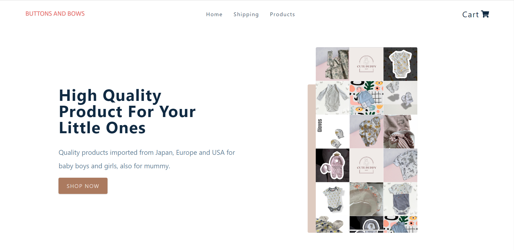
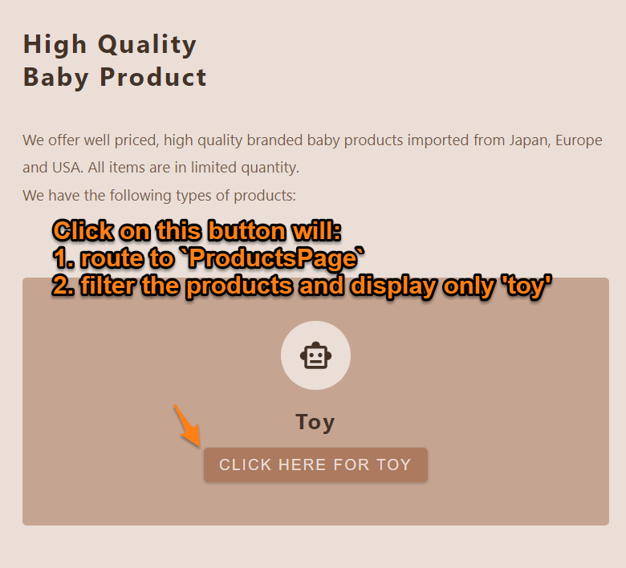

# E-Commerce Website

## Demo of this app:

### Or Go to the live site and try it for yourself [here](https://lucent-semolina-3b2012.netlify.app/)

## What is this project about?

- This is a React JS based e-commerce app that allows shoppers to view, sort, and filter products according to different criteria.
- It has a cart system, payment system etc.
- This serves as a TypeScript, ReactJS while designing this project.
- I have used dummy data from Fake Store API.

## What technologies were used?

- react.js (create-react-app)
- TypeScript

### Styling:

- styled-components
- CSS

### Routing:

- react-router

### Data API:

- Fake Store API

### CMS:

- axios

### Hosting and server side functions

- Netlify

## Links to source code and live site:

- [Live site hosted on Netlify](https://lucent-semolina-3b2012.netlify.app/)
- [Source code on Github](https://github.com/Shikharmall/e-commerce)

## How to navigate this project? Click on the link for related source code:

1. A simple [Sanity CMS schema](https://github.com/1codingguy/typescript-e-commerce/blob/main/cutebuddy/schemas/product.js) is used: add, amend or delete product can be done on the CMS instead of in the source code.

2. Click on each `ServicesCard` button will do two things:

- route to `ProductsPage`;
- filter the products according to which button gets clicked on.
  
  - To achieve this, it has to go through three steps:

1. clear the previous filters
2. set `isClickFromServices` state variable to tru
3. update filters according to the button that gets clicked on

[Click here](https://github.com/1codingguy/typescript-e-commerce/blob/main/src/components/Services/ServicesCards.tsx#L21) for the relevant code.

- Why is there a `isClickFromServices` variable?
  - `ProductsPage` should display products of relevant service if routed from `Services` component.
  - But each time `ProductsPage` is mounted, `filters` are cleared since the page should display all products.
  - That means there are two cases for `ProductsPage`:
    - when the component mounts `filters` are cleared.
    - when the component mounts, and it is routed from `Services` component, `filters` should contain a value.
  - Therefore, an if statement is used to check if the page is routed from `Services`, [click here for the relevant code](https://github.com/1codingguy/typescript-e-commerce/blob/main/src/pages/ProductsPage.tsx#L10).

3. Shoppers can choose to view the products in `ListView` or `GridView`. [Click here for relevant code](https://github.com/1codingguy/typescript-e-commerce/blob/main/src/components/ProductList.tsx#L24).

4. Shoppers are able to filter products by different criteria, such as keyword, price, etc.

- [Click here for code structure](https://github.com/1codingguy/typescript-e-commerce/blob/main/src/components/Filters/Filters.tsx#L22);
- [Click here for filters updating function](https://github.com/1codingguy/typescript-e-commerce/blob/main/src/reducers/filter_reducer.ts#L61).

5. Products can be sorted by price or name, in ascending or descending order [Click here for sorting function](https://github.com/1codingguy/typescript-e-commerce/blob/main/src/reducers/filter_reducer.ts#L41).

6. Payment is processed by Stripe API, [click here for relevant code](https://github.com/1codingguy/typescript-e-commerce/blob/main/src/components/CheckoutForm.tsx).

7. Please note that the newsletter subscription part on `HomePage` does not do anything.

### About filtering:

Lots of thoughts were given about filter functions related to 'category' and 'searching' 

